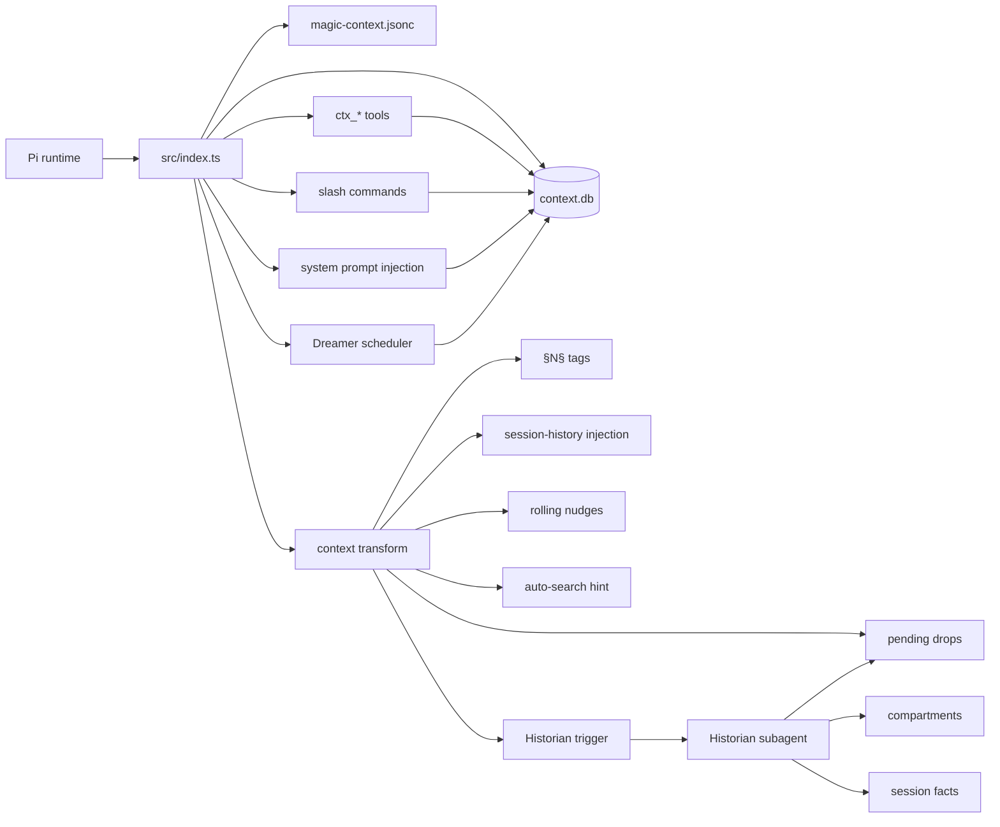
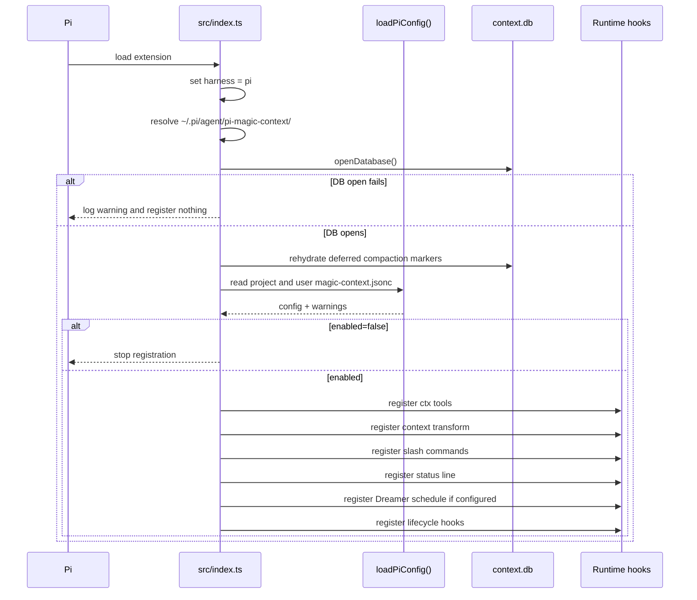
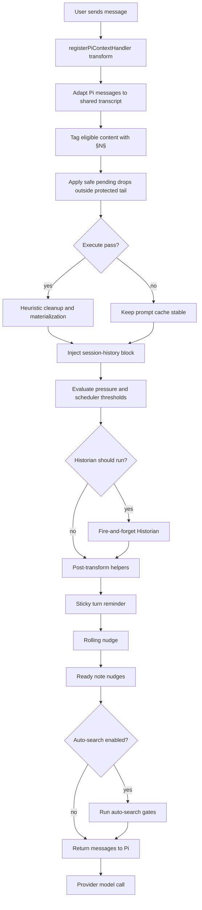
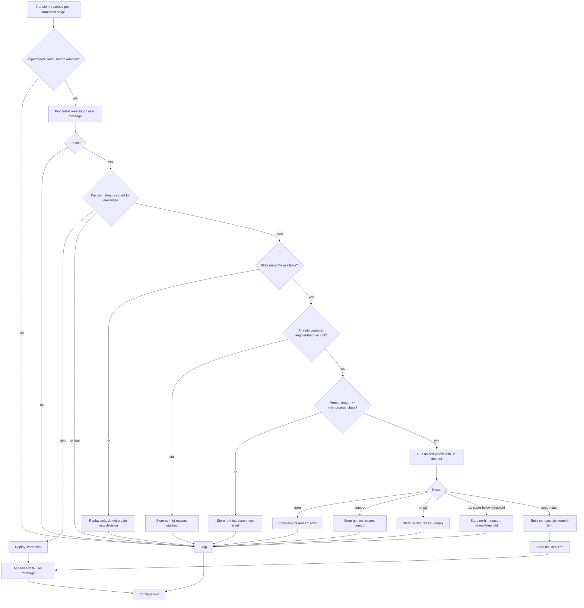
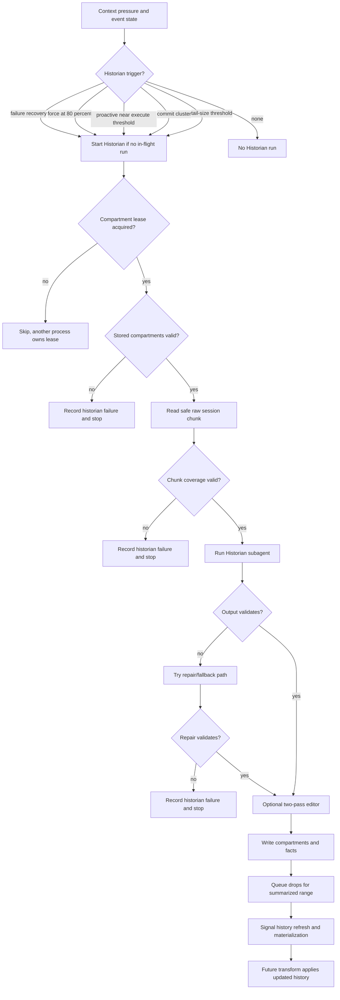
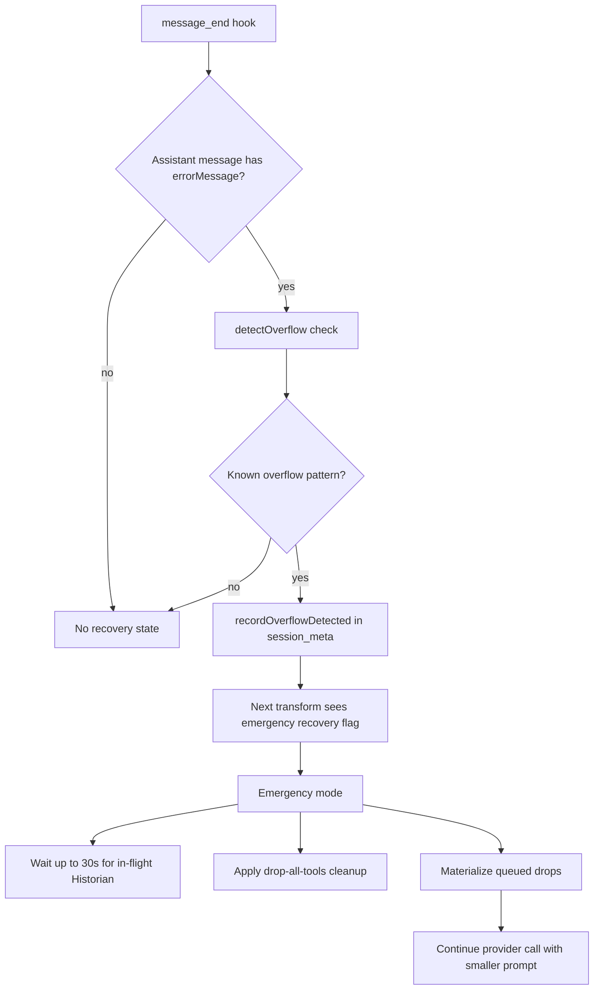
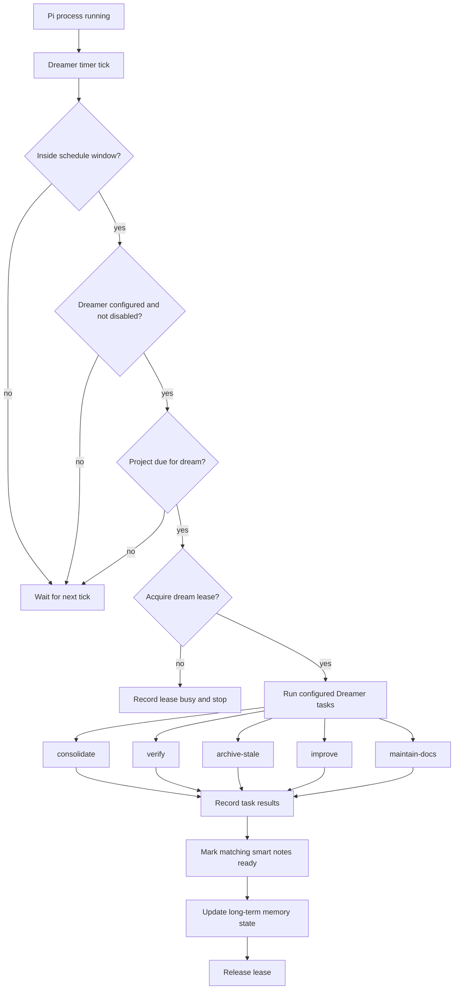
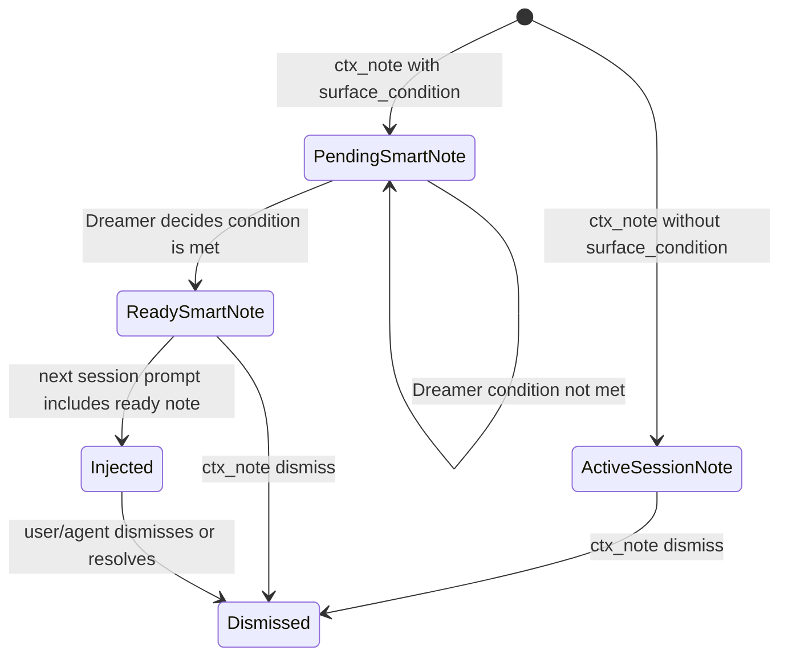
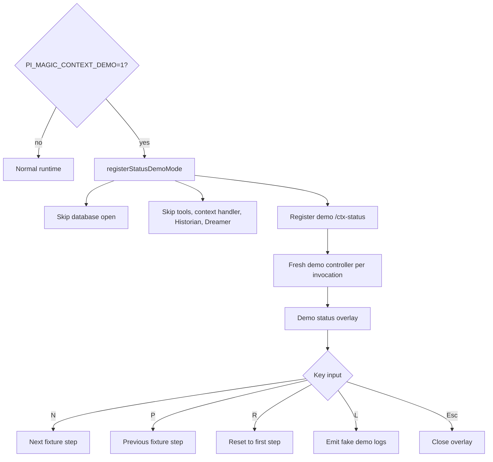
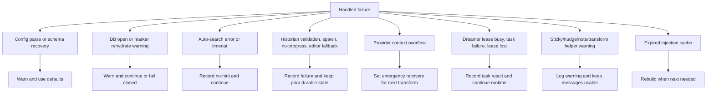

# Runtime diagrams

These diagrams explain how the Pi Magic Context extension fits together at runtime.

## 1. Big picture



## 2. Extension startup



## 3. Per-turn transform pipeline



## 4. Auto-search trigger and gates



## 5. Historian trigger and publish flow



## 6. Emergency overflow recovery



## 7. Dreamer lifecycle



## 8. Smart notes



## 9. Tool and storage flow

```mermaid
flowchart LR
   Agent[Assistant] --> Tools{ctx tools}
   Tools --> Search[ctx_search]
   Tools --> Memory[ctx_memory]
   Tools --> Notes[ctx_note]
   Tools --> Reduce[ctx_reduce]

   Search --> DB[(context.db)]
   Memory --> DB
   Notes --> DB
   Reduce --> DB

   DB --> Memories[memories]
   DB --> Facts[session facts]
   DB --> Compartments[compartments]
   DB --> Tags[tags and source contents]
   DB --> Pending[pending_ops]
   DB --> Meta[session_meta]

   Meta --> Status[/ctx-status]
   Memories --> Prompt[system prompt and history injection]
   Facts --> Prompt
   Compartments --> Prompt
   Pending --> Transform[future transform materialization]
```

## 10. `/ctx-status` overlay data flow

```mermaid
flowchart TD
   Command[/ctx-status] --> Dialog[Status dialog]
   Dialog --> Cached[Cached first paint]
   Cached --> Meta[session_meta]
   Cached --> Render1[Render immediately]
   Render1 --> Deferred[queueMicrotask full refresh]
   Deferred --> Full[buildPiStatusDetail]
   Full --> DB[(context.db)]
   Full --> Prompt[ctx.getSystemPrompt token estimate]
   Full --> Tools[Pi tool definition estimate]
   Full --> Render2[Refresh overlay]
   Render2 --> Timer[1s live refresh while open]
   Timer --> Full
```

## 11. Demo mode



## 12. Failure handling map


